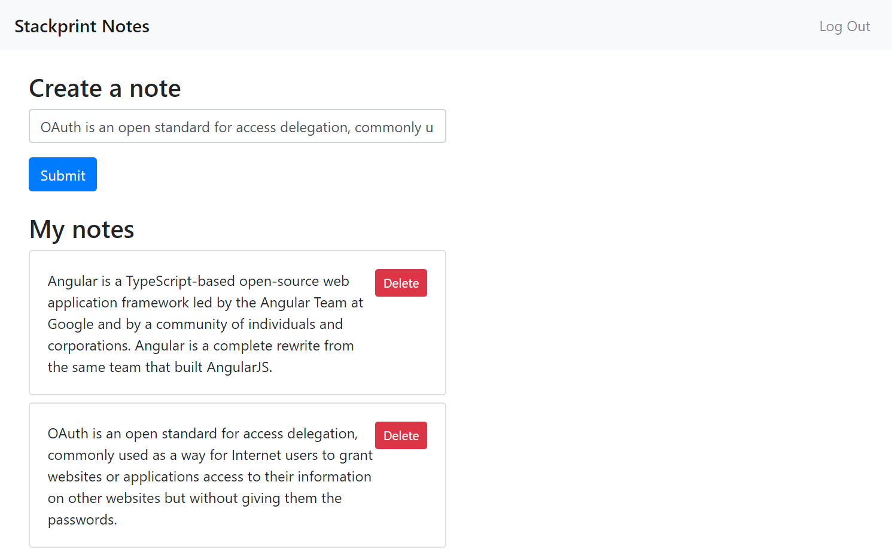

# Stackprint Angular Example

This is a small example on how to use [Stackprint](https://stackprint.io) & [Auth0](https://auth0.com) with [Angular](https://angular.io) to build a full web application for managing personal notes.

The app connects to a Stackprint API using fully typed [generated client code](modules/typescript-angular-client) that is used in the [NotesComponent](src/app/notes/notes.component.ts) to provide a convenient UI for managing personal notes.

## Setup

- Adapt the Auth0 configuration in `src/app/environments/environment.ts`
- Run:

```
npm install
npm start
```

## Screenshot


